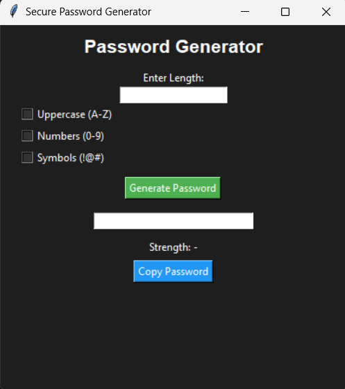
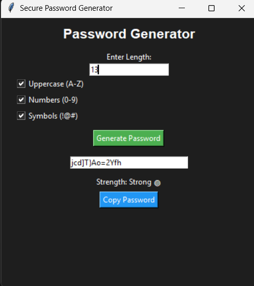

# Password Generator

A simple Python app that creates secure passwords.

## Features:
- Choose password length
- Add uppercase letters
- Add numbers
- Add symbols
- Shows password strength
- Copy password

## How to run:
python password_generator.py

## Language:
Python

## Preview
### Before

### After

